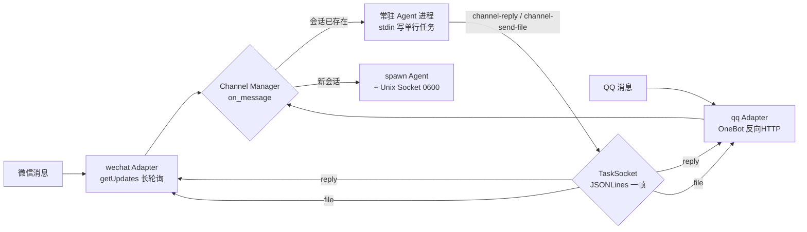
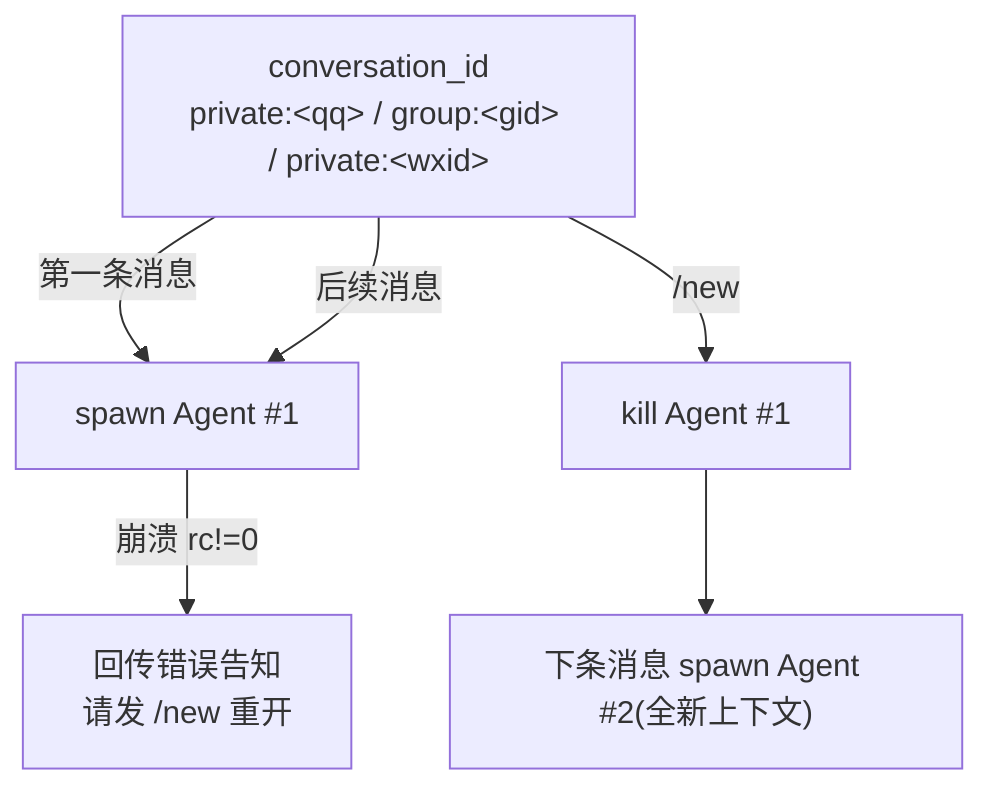
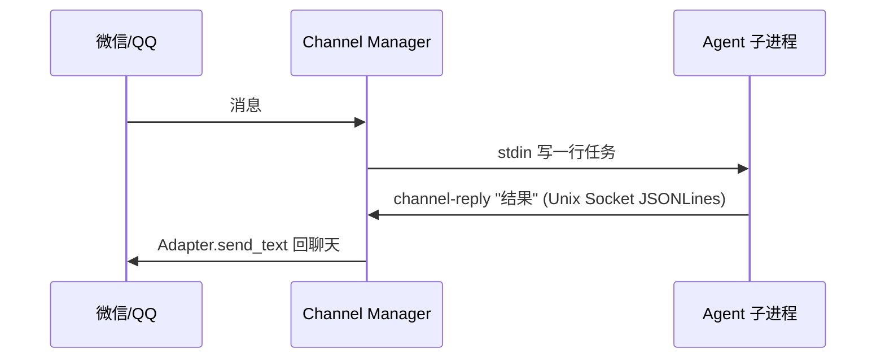

# Agent-Channel


> QQ / 微信 外部通道：把微信、QQ 消息变成你 Agent 的输入，再把 Agent 的回复与文件发回聊天。
> Agent 完全无感 —— 不依赖微信/QQ 任何 SDK，只需满足一个 20 行的 stdin 协议。

## 架构

```
微信 / QQ ──► Adapter ──► Channel Manager ──► Agent 子进程
    ▲                        │  ▲                  │
    └────── 回复/文件 ◄───────┘  └── channel-reply ◄┘ (Unix Socket, JSONLines)
```

- **触发式常驻会话**：每个聊天(`conversation_id`)常驻一个 Agent 进程，`stdin` 长开、CPU≈0；
  消息到达才写一行任务；跨聊天进程天然并行、互不串台；发 `/new` 重置上下文。
- **平台无关消息模型**：QQ/微信先转成统一 `Message{platform, conversation_id, sender_id, text, attachments}`，
  Agent 不认识任何 IM 协议。
- **零第三方依赖**：全部标准库。收/发/文件/群@ 均自实现。

### 数据流



### 会话模型



### Agent 侧回话协议



## 快速开始

零配置先跑通协议链路（自带 demo Agent，无需真 IM）：

```bash
git clone https://github.com/Xiyinnnnnn/Agent-Channel.git && cd Agent-Channel
python3 channel/manager.py --test "你好，Agent"
```

看到 `outbox-local.log` 尾部出现 demo-agent 的回复即链路通。

**换成真实 Agent**：把 `channel/config.json` 的 `agent` 指向你的 Agent 程序即可，例如
[Agent-in-Terminal](https://github.com/Xiyinnnnnn/Agent-in-Terminal) 的 `term_agent.py`：

```bash
cp channel/config.example.json channel/config.json
# 编辑 config.json："agent": "/path/to/term_agent.py"，adapters 保持 ["local"]
python3 channel/manager.py --serve          # 常驻
python3 channel/manager.py --test "帮我写首诗"  # 全链路验证
```

**接 QQ / 微信**：改 `config.json` 的 `adapters` 为 `["qq"]` / `["wechat"]`，填平台配置后重启。
QQ 走 OneBot11(NapCat/Lagrange) 反向 HTTP，微信走 iLink 长轮询 —— 详见 `doc/`。

## 如何接入自己的 Agent（或别人的 Agent 端口）

Channel 不限定 Agent 是谁。它只做一件事：**把任务以一行文本喂给一个本地进程**，并等该进程
通过 socket 回话。因此：

- 你的 Agent 只要是一个「从 stdin 读一行任务、完成后主动回话」的程序，就能接入 —— 协议全貌
  见 [`doc/03-Agent接入协议.md`](doc/03-Agent接入协议.md)，参考 [`agents/demo_agent.py`](agents/demo_agent.py)。
  不限定语言/框架/模型，20 行即可。
- Agent 跑在某个**端口 / HTTP / 远程机器**上？写一个薄壳进程：读 stdin 一行任务 → 转发到该端口 →
  把结果经 `channel-reply` 回传即可（约 20 行，见协议文档的「端口转发壳」示例）。或者直接改
  `ChannelManager._spawn_session` 里的进程驱动换成你自己的 —— Agent 附着方式是一个可替换边界。
- 文件回传用 `channel-send-file "<绝对路径>"`；收到的图片/附件会以 `[图片] 路径 [附件] 路径`
  形式写进任务文本。

## 目录

```
channel/          Manager + 适配器 + Agent侧CLI + 微信iLink客户端
  manager.py      核心：会话管理/任务投喂/socket服务
  adapters/       local(测试) / qq(OneBot11) / wechat(iLink)
  cli/            channel-reply / channel-send-file（Agent 侧）
  ilink/          微信 iLink 登录与收发（逆向公开协议）
control/          桌面控制中心 TUI（启动/停止/扫码登录/多模态开关）
agents/           demo_agent.py 最小示例 Agent
doc/              面向 Agent 的项目文档（详细协议/适配器开发/配置）
```

详细文档（消息模型、适配器开发、配置参考、已知边界）全部在 [`doc/`](doc/00-概览.md)。

## License

[MIT](LICENSE)
